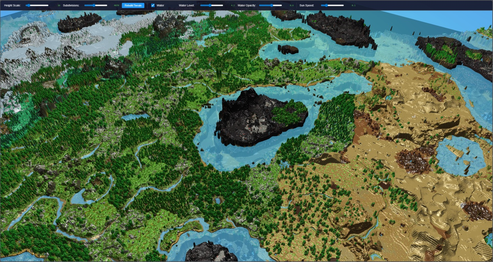
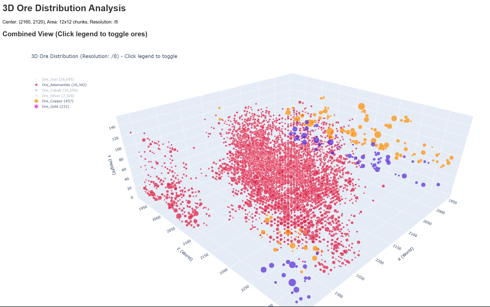
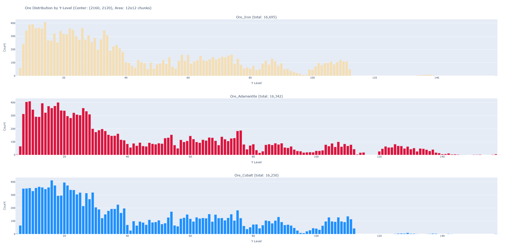

# Hytale Region Parser Examples

This directory contains example scripts demonstrating various use cases for the `hytale_region_parser` library.

## Setup

Before running any example, make sure you have the library installed:

```bash
# From the repository root
pip install -e .

# Or from PyPI
pip install hytale-region-parser
```

**Important:** Each example has a `region_path` or `chunks_folder` variable near the top of the file. Update this path to point to your Hytale save files.

Default Hytale save location:
```
C:\Users\<username>\AppData\Roaming\Hytale\UserData\Saves\Server\universe\worlds\default\chunks\
```

## Examples

### 1. Basic Parsing (`basic_parsing.py`)

Demonstrates the simplest way to parse a region file and get a summary of its contents.

**Features:**
- Open and read a region file
- Print metadata (region coordinates, chunk count)
- Display block distribution sorted by count
- List containers found in the region

**Usage:**
```bash
python examples/basic_parsing.py
```

---

### 2. Full Block Export (`full_block_export.py`)

Exports all block positions with their exact world coordinates to JSON files.

**Features:**
- Extract every block with its world position
- Output both formatted and compact JSON
- Display file sizes for the exports

Ever wanted to inflate 30MB of binary data to about 2GB of json for absolutely no reason? This is the script to run.

**Usage:**
```bash
python examples/full_block_export.py
```

---

### 3. Iterate Chunks (`iterate_chunks.py`)

Shows how to iterate over chunks one at a time for custom processing without loading everything into memory.

**Features:**
- Use the context manager pattern
- Process chunks individually
- Access chunk-level data (sections, block names, containers, components)

**Usage:**
```bash
python examples/iterate_chunks.py
```

---

### 4. Container Contents Summary (`container_contents.py`)

Parses all containers (chests, barrels, etc.) and generates a comprehensive inventory summary.

**Features:**
- Find all containers in a region (or multiple regions)
- Aggregate all items across all containers
- Display item statistics (stack counts, total quantities)
- Show detailed container information with contents

**Usage:**
```bash
python examples/container_contents.py
```

---

### 5. Ore Distribution Analysis (`ore_distribution.py`)

Analyzes the distribution of ore blocks in a specific area, useful for understanding world generation.

**Features:**
- Scan a 3x3 chunk area around specified world coordinates
- Count all `Ore_*` blocks by type
- Analyze Y-level distribution for each ore type
- Display histogram of ore density by Y-range
- Show sample ore positions

This script additionally requires the numpy and plotly libraries.  
Install with `pip install numpy plotly`

**Usage:**
```bash
python examples/ore_distribution.py --help

python .\examples\ore_distribution.py --center_x 2160 --center_z 2120 --area_size 5 --output_filename ores_mine --plot3d_resolution 4
```

**Configuration:**
- `center_x`, `center_z`: World coordinates for the center of the analysis area
- `area_size`: Size of the square area in chunks (default: 3 for 3x3)

---

### 6. Surface Map and Heightmap Generator (`surface_map.py`)

Generates two PNG images from all region files in a folder:
- **Surface map:** A top-down view where each pixel shows the color of the highest block at that position
- **Heightmap:** A grayscale image where brightness corresponds to the height of the highest block

**Features:**
- Automatically scans all `.region.bin` files in a folder
- Creates a complete world overview image
- Color-coded blocks based on block type
- Normalized heightmap for terrain visualization
- Displays block color legend for common blocks

This script requires the Pillow and numpy libraries.  
Install with `pip install pillow numpy`

**Usage:**
```bash
# Use default Hytale chunks folder
python examples/surface_map.py

# Specify a custom folder
python examples/surface_map.py /path/to/chunks/folder

# Specify output filename prefix
python examples/surface_map.py /path/to/chunks --output my_world
```

**Output files:**
- `map_surface.png` - Top-down surface view with block colors
- `map_heightmap.png` - Grayscale heightmap

To view the generated output files, the HTML Viewer in surface_map_viewer.html can be used.

Screenshots of map of V1 world generator after a couple hours of playtime:



---

## Output Examples

### Basic Parsing Output
```
REGION FILE SUMMARY
============================================================
Region Coordinates: (0, 0)
Chunks with data: 256

BLOCK DISTRIBUTION (top 30 by count):
----------------------------------------
  Stone                                   1,234,567 (45.23%)
  Dirt                                      456,789 (16.73%)
  ...
```

### Ore Distribution Output
```
ORE DISTRIBUTION REPORT
======================================================================
Center coordinates: (2000, 2000)
Area size: 3x3 chunks
Chunks found: 9 / 9

ORE TOTALS
----------------------------------------------------------------------
Ore Type                               Count     Percentage
----------------------------------------------------------------------
  Ore_Copper                             1,234        45.00%
  Ore_Iron                                 567        20.67%
  Ore_Gold                                 234         8.53%
  ...

Y-LEVEL DISTRIBUTION
----------------------------------------------------------------------
Ore_Copper:
  Y range: 12 to 128
  Average Y: 64.5
  Peak Y: 56 (most common level)
  Distribution by Y-range:
    Y   0-15  :     45 ███
    Y  16-31  :    123 ████████
    Y  32-47  :    234 ███████████████
    ...
```

Screenshots of the generated HTML plots





## Tips

1. **Memory Usage:** For very large regions, use `iter_chunks()` instead of `to_dict()` to process chunks one at a time.

2. **Performance:** Use `to_dict_summary_only()` when you only need block counts, not individual positions. When parsing entire worlds, consider using multiprocessing. See surface_map.py for examples.

3. **Multiple Regions:** To process multiple regions, loop over `.region.bin` files:
   ```python
   from pathlib import Path
   chunks_folder = Path("path/to/chunks")
   for region_file in chunks_folder.glob("*.region.bin"):
       with RegionFileParser(region_file) as parser:
           # process...
   ```

4. **Custom Block Filters:** When iterating chunks, filter blocks by name prefix:
   ```python
   for chunk in parser.iter_chunks():
       for section in chunk.sections:
           for block_name, count in section.block_counts.items():
               if block_name.startswith("Ore_"):
                   print(f"{block_name}: {count}")
   ```
